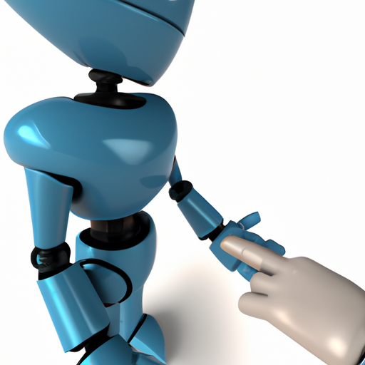

# Nudge Bot


Nudge is a Golang application that sends nudge messages to users with overdue pull requests. It also has an optional
integration with Slack. This has been inspired by the paper titled "Nudge: Accelerating Overdue Pull Requests Toward
Completion" available at https://dl.acm.org/doi/abs/10.1145/3544791.

Nudge is available to use on GitHub Marketplace. With Nudge, you can automate the communication process for overdue pull
requests, allowing you to stay on top of your project and keep it moving forward.

## Features

- Automated nudge messages for overdue pull requests
- Optional integration with Slack
- Support for multiple languages
- Customizable nudge message

## Installation

1. Fork the repository.
2. Clone the repository.
3. Install the dependencies: ```go get -u ./...```
4. Build and run the application: ```make dev-docker```

**Run tests**
```shell
make run-tests
```

**Create a release**
```shell
make release
```

**Create build**

```shell
make docker
```

**Design Overview**
The Nudge system consists of three main components: A machine learning-based effort estimation
model that predicts the lifetime of a given pull request, an activity detection module to establish
what the current state of the pull request is, and an actor determination module to identify who
would be need to take action

* _Prediction Model._ As of today this has not been open sourced and will be be made available soon.
* _Activity Detection_ The role of the activity detection module is to help the Nudge system understand if there has
  been any activity performed by the author or the reviewer of the pull request of
  late. This helps the Nudge system not send a notification, even though the lifetime of the pull request has exceeded
  its predicted lifetime. This module serves as a gatekeeper that gives the Nudge
  system a “go” or “no go” by observing various signals in the pull request environment.
* _Actor Identification_. The primary goal of this module is to determine the blocker of the change
  (the author or a reviewer) and engage them in the notification, by explicitly mentioning them. This
  module comes into action once the pull request meets the criteria set by the prediction module
  and the Activity Detection modules. Once the Nudge system is ready to send the notification, the
  Actor Identification module provides information to the Nudge notification system to direct the
  notification toward the change blocker.


_Nudge Workflow._ The three modules are combined with a notification system to form Nudge as
shown in Figure above.

## Contributing

Pull requests are welcome. For major changes, please open an issue first to discuss what you would like to change.

## License

[MIT](https://choosealicense.com/licenses/mit/)